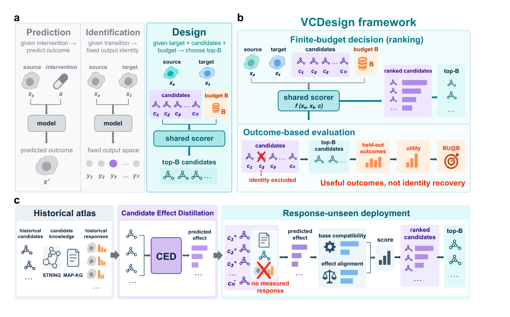

<a id="top"></a>

<div align="center">

<h1>VCDesign-CED</h1>
<h3>Candidate-conditioned inverse modeling for cellular intervention design</h3>

<p>
  <a href="https://boom5426.github.io/VCDesign-CED/"></a>
  
  
  <a href="pyproject.toml"></a>
  <a href="paper/VCDesign.pdf"></a>
  <a href="https://huggingface.co/datasets/Boom5426/VCDesign"></a>
</p>

<p><strong>Rank the experiments worth running, not just the intervention identity.</strong></p>

<p>
  <a href="https://boom5426.github.io/VCDesign-CED/">🌐 Project website</a> ·
  <a href="#quick-start">🚀 Quick start</a> ·
  <a href="#how-it-works">🧭 How it works</a> ·
  <a href="https://huggingface.co/datasets/Boom5426/VCDesign">🤗 Data</a> ·
  <a href="#reproduce">🧪 Reproduce</a> ·
  <a href="paper/VCDesign.pdf">📄 Paper</a>
</p>

</div>

**VCDesign** formulates cellular intervention design as finite-budget ranking over a variable candidate set. Given a source state, a desired target state, feasible candidates, and a budget, it prioritizes candidates by the utility of their independently measured outcomes. **VCDesign-CED** extends this setting to candidates whose perturbational responses have not yet been measured.

<p align="center">
  <a href="paper/VCDesign.pdf"></a>
  <br>
  <sub>VCDesign framework and VCDesign-CED reference realization · Figure 1 · <a href="paper/VCDesign.pdf">Read the paper ↗</a></sub>
</p>

<a id="how-it-works"></a>

## ✨ From prediction to design

<table>
  <tr>
    <td valign="top" width="33%">
      <b>🎯 Rank a candidate set</b><br><br>
      Score a variable set of feasible interventions for a requested source-to-target transition and select the top-B prefix.
    </td>
    <td valign="top" width="33%">
      <b>🧪 Evaluate decisions by outcomes</b><br><br>
      Exclude the query identity and grade selected candidates using independently measured held-out outcomes.
    </td>
    <td valign="top" width="33%">
      <b>🧬 Transfer to unmeasured candidates</b><br><br>
      Distill historical responses into an effect predictor using STRING and MAP-KG candidate knowledge.
    </td>
  </tr>
</table>

### Choose the information regime

| Candidate information at decision time | Recommended route |
| :--- | :--- |
| Measured candidate responses are available | Direct response-profile retrieval |
| Candidate responses are unavailable | VCDesign-CED predicted-effect scoring |

Both routes use the same downstream decision interface: a candidate pool, an experimental budget, and outcome-based evaluation.

<a id="quick-start"></a>

## 🚀 Quick start

**Python 3.11 is required.** The bundled demo is synthetic and does not download biological data.

```bash
git clone https://github.com/Boom5426/VCDesign-CED.git
cd VCDesign-CED
python3.11 -m venv .venv
source .venv/bin/activate
python -m pip install -e ".[model,data,dev]"
python examples/ced_demo.py
python -m pytest -q
```

> [!NOTE]
> The demo checks response-basis construction, ridge effect prediction, missing-knowledge handling, and score fusion. Its scores are a software smoke test, not a biological result.

<details>
<summary><b>Install the exact tested CPU environment</b></summary>

```bash
python3.11 -m venv .venv
source .venv/bin/activate
python -m pip install -r requirements-cpu.txt
python -m pip install -e . --no-deps
```

For GPU training, install the PyTorch 2.4 build appropriate for the local CUDA system, then install the remaining dependencies from `requirements.txt`.

</details>

## 🧠 Candidate Effect Distillation

CED learns a deliberately simple transfer map:

```text
historical perturbation responses ──► response basis
                                      ▲
STRING + MAP-KG candidate features ──► ridge effect predictor
                                      │
unmeasured candidate knowledge ──────► predicted effect ──► target alignment
```

The deployment candidate's measured response is never an input. Candidates missing all supported knowledge modalities receive the frozen all-missing score defined by the protocol.

## 🌍 Evaluation contexts

| Context | Perturbation setting | Role |
| :--- | :--- | :--- |
| **K562** | CRISPRi Perturb-seq | Primary genome-scale setting |
| **RPE1** | CRISPRi Perturb-seq | Cross-context evaluation |
| **HepG2** | CRISPRi Perturb-seq | External cellular context |
| **Jurkat** | CRISPRi Perturb-seq | External cellular context |

Exact source versions, variants, and citations are listed in [DATA_SOURCES.md](DATA_SOURCES.md).

## 🤗 Data & frozen artifacts

The processed feature matrices, four-context packs, comparator scores, selected checkpoint, run records, and SHA-256 manifest are hosted in the companion dataset:

<p align="center">
  <a href="https://huggingface.co/datasets/Boom5426/VCDesign"></a>
</p>

| Released artifact | Contents |
| :--- | :--- |
| `inputs/` | Frozen response, STRING, MAP-KG, candidate-knowledge, and comparator arrays |
| `checkpoints/` | Selected epoch-8 reference checkpoint |
| `records/` | Training, selection, evaluation, external-baseline, and verification records |
| `DATA_MANIFEST.json` | Byte sizes and SHA-256 digests for release verification |

<a id="reproduce"></a>

## 🔁 Reproduce

Download the frozen processed inputs, checkpoints, and run records into the repository root, then verify every released byte:

```bash
python -m pip install "huggingface_hub>=0.35"
hf download Boom5426/VCDesign --repo-type dataset --local-dir . \
  --include 'inputs/**' 'checkpoints/**' 'records/**' 'DATA_MANIFEST.json'
python tools/verify_processed_data.py --root .
```

Train the primary base scorer with an explicit, new output directory:

```bash
python -m gene_open_inverse.final_clean_model_v1.train \
  --config configs/paper_run_v1.json \
  --output outputs/final_clean_train \
  --device cuda
```

The training command refuses to overwrite an existing output directory. The frozen reference checkpoint is `checkpoints/final_clean_epoch_008.pt`; its SHA-256 is recorded in both the run configuration and processed-data manifest.

| Goal | Entry point |
| :--- | :--- |
| Try CED without external data | [`examples/ced_demo.py`](examples/ced_demo.py) |
| Verify the processed release | [`tools/verify_processed_data.py`](tools/verify_processed_data.py) |
| Inspect the frozen run contract | [`configs/paper_run_v1.json`](configs/paper_run_v1.json) |
| Run the complete command sequence | [REPRODUCE.md](REPRODUCE.md) |
| Understand the source tree | [PROJECT_STRUCTURE.md](PROJECT_STRUCTURE.md) |

## 🗂️ Repository map

```text
src/gene_open_inverse/
├── candidate_effect_distillation_v1/  CED basis, predictor, fusion, evaluation
├── final_clean_model_v1/              base scorer, selection, locked evaluation
├── four_context_v1/                   K562/RPE1/HepG2/Jurkat data contracts
├── external_baselines_v1/             comparator adapters and reporting
├── open_vocab_generalization_v1/      masking and open-vocabulary analyses
└── model/                             knowledge features and model components

configs/                               portable paper-run configuration
examples/                              synthetic end-to-end demonstration
tools/                                 integrity and release utilities
paper/                                 manuscript PDF
```

> [!IMPORTANT]
> GitHub contains the source, configuration, synthetic demo, and manuscript. Large processed inputs and frozen artifacts live in the companion Hugging Face release; raw H5AD matrices remain with their original public repositories.

---

<p align="center">
  <b>From predicting responses to prioritizing experiments.</b><br>
  <sub><a href="#top">Back to top ↑</a></sub>
</p>
