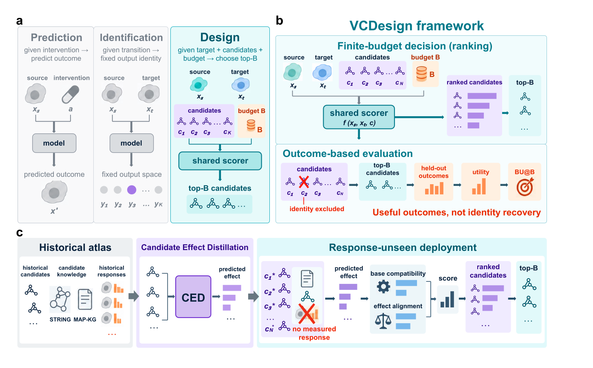

<h1>VCDesign</h1>
<h3>面向虚拟细胞的有限预算干预设计</h3>

  
  
  
  
  
  

<strong>排序真正值得做的实验，而不只是识别干预身份。</strong>

<a href="README.md">English</a> · <strong>简体中文</strong>

  <a href="https://boom5426.github.io/VCDesign-CED/">🌐 项目主页</a> ·
  <a href="#快速开始">🚀 快速开始</a> ·
  <a href="#从预测到设计">🧭 工作原理</a> ·
  <a href="https://huggingface.co/datasets/Boom5426/VCDesign">🤗 数据</a> ·
  <a href="#复现实验">🧪 复现实验</a> ·
  <a href="paper/VCDesign.pdf">📄 论文</a>

**VCDesign** 将细胞干预设计表述为：在一个可变候选集合上进行**有限预算排序**。给定从起始状态到目标状态的转变需求，求解器需要对可执行干预进行排序；评价时，则使用独立测量、未参与排序的真实结果，对实际会执行的 top-$B$ 候选进行评分。在当前 CRISPRi benchmark 中，utility 衡量转录组响应方向与目标方向的一致程度。对于自身响应不在 CED effect atlas 中的候选，**VCDesign-CED** 将直接候选打分与基于历史扰动测量和生物学知识推断得到的候选效应结合起来。

  
   
  VCDesign 框架与 VCDesign-CED 参考实现 · Figure 1 · <a href="paper/VCDesign.pdf">阅读论文 ↗</a>

## ✨ 从预测到设计

| 核心环节 | 含义 |
| :--- | :--- |
| 🎯 对候选集合排序 | 面向给定的起始态到目标态转变，对一个可变的可行干预集合进行打分，并选择 top-B 候选。 |
| 🧪 用真实结果评价决策 | 排除 query 自身的干预身份，并使用独立测量、held-out 的真实结果评价最终选出的候选。 |
| 🧬 向未测候选迁移 | 利用 STRING 和 MAP-KG 候选知识，将历史扰动响应蒸馏为候选效应预测器。 |

### 根据信息条件选择路径

| 决策时可用的候选信息 | 推荐路径 |
| :--- | :--- |
| 已有候选的实测响应 | Direct response-profile retrieval |
| 候选响应尚未测量 | VCDesign-CED predicted-effect scoring |

两条路径共享相同的下游决策接口：候选池、实验预算，以及基于真实结果的评价。

### 论文目前支持的主要结论

- 在三个 held-out 细胞环境中，从 CED atlas 中屏蔽候选响应后，相比相同 base scorer，pooled paired BU@20 提升 `+0.0492`；在 20 个被选候选中，平均额外选中 `1.11` 个 top-5% 候选。
- 当候选响应已经在其他 context 中被测量时，direct profile retrieval 的得分高于 VCDesign-CED（pooled BU@20：`0.675` vs `0.508`）。
- Response masking 仅作用于 CED atlas，并不意味着抹去所有历史监督：冻结的 base scorer 曾在 68% 的 masked candidate identities 上接受过训练。论文同时报告了 base-scorer-unseen 子集和锁定的 K562 identity test。

这些结果是针对**转录组方向性优先级排序**的回顾性结果，并不构成对真实生物学终点改善的前瞻性证据。held-context 的 unit-direction 配置是在相同评价池上选定，并在运行外部 baselines 前冻结；K562 配置则在其 locked split 打分前冻结。

## 🚀 快速开始

**需要 Python 3.11。** 仓库自带的 demo 使用合成数据，不会下载真实生物数据。

~~~bash
git clone https://github.com/Boom5426/VCDesign-CED.git
cd VCDesign-CED
python3.11 -m venv .venv
source .venv/bin/activate
python -m pip install -e ".[model,data,dev]"
python examples/ced_demo.py
python -m pytest -q
~~~

> [!NOTE]
> demo 会检查 response-basis 构建、ridge effect prediction、缺失知识处理和 score fusion。其输出分数只用于软件 smoke test，不代表生物学结果。

## 🧠 Candidate Effect Distillation

CED 学习的是一个刻意保持简单的迁移映射：

~~~text
历史扰动响应 ─────────────────────► response basis
                                      ▲
STRING + MAP-KG 候选特征 ─────────► ridge effect predictor
                                      │
未测候选的生物学知识 ─────────────► predicted effect ──► target alignment
~~~

部署时，候选自身的实测响应**不会**作为输入。对于缺失所有受支持知识模态的候选，系统使用协议中冻结的 all-missing score。

## 🌍 评价环境

| Context | 扰动设置 | 作用 |
| :--- | :--- | :--- |
| **K562** | CRISPRi Perturb-seq | 主要 genome-scale 场景 |
| **RPE1** | CRISPRi Perturb-seq | 跨 context 评价 |
| **HepG2** | CRISPRi Perturb-seq | 外部细胞环境 |
| **Jurkat** | CRISPRi Perturb-seq | 外部细胞环境 |

精确的数据来源版本、variants 和引用见 [DATA_SOURCES.md](DATA_SOURCES.md)。

## 🤗 数据与冻结产物

处理后的 feature matrices、四个 context 的数据包、comparator scores、选定 checkpoint、运行记录以及 SHA-256 manifest 均发布在配套数据集中：

  

| 发布内容 | 包含内容 |
| :--- | :--- |
| `inputs/` | 冻结的 response、STRING、MAP-KG、candidate-knowledge 和 comparator arrays |
| `checkpoints/` | 选定的 epoch-8 参考 checkpoint |
| `records/` | 训练、选择、评价、外部 baseline 和验证记录 |
| `DATA_MANIFEST.json` | 用于发布校验的文件大小与 SHA-256 摘要 |

## 🔁 复现实验

将冻结的 processed inputs、checkpoints 和 run records 下载到仓库根目录，然后验证发布内容：

~~~bash
python -m pip install "huggingface_hub>=0.35"
hf download Boom5426/VCDesign --repo-type dataset --local-dir . \\
  --include 'inputs/**' 'checkpoints/**' 'records/**' 'DATA_MANIFEST.json'
python tools/verify_processed_data.py --root .
~~~

训练 primary base scorer：

~~~bash
python -m gene_open_inverse.final_clean_model_v1.train \\
  --config configs/paper_run_v1.json \\
  --output outputs/final_clean_train \\
  --device cuda
~~~

训练命令会拒绝覆盖已有输出目录。冻结的参考 checkpoint 为 `checkpoints/final_clean_epoch_008.pt`；其 SHA-256 同时记录在运行配置和 processed-data manifest 中。

| 目标 | 入口 |
| :--- | :--- |
| 不依赖外部数据体验 CED | [`examples/ced_demo.py`](examples/ced_demo.py) |
| 验证 processed release | [`tools/verify_processed_data.py`](tools/verify_processed_data.py) |
| 查看冻结的运行协议 | [`configs/paper_run_v1.json`](configs/paper_run_v1.json) |
| 运行完整命令序列 | [REPRODUCE.md](REPRODUCE.md) |
| 理解源码目录结构 | [PROJECT_STRUCTURE.md](PROJECT_STRUCTURE.md) |

## 🗂️ 仓库结构

~~~text
src/gene_open_inverse/
├── candidate_effect_distillation_v1/  CED basis、predictor、fusion、evaluation
├── final_clean_model_v1/              base scorer、selection、locked evaluation
├── four_context_v1/                   K562/RPE1/HepG2/Jurkat data contracts
├── external_baselines_v1/             comparator adapters 与 reporting
├── open_vocab_generalization_v1/      masking 与 open-vocabulary analyses
└── model/                             knowledge features 与模型组件

configs/                               可移植的 paper-run 配置
examples/                              合成端到端 demo
tools/                                 完整性校验与 release utilities
paper/                                 论文 PDF
~~~

> [!IMPORTANT]
> GitHub 仓库包含源码、配置、合成 demo 和论文。大型 processed inputs 与冻结产物存放在配套 Hugging Face release 中；原始 H5AD 矩阵仍保留在其原始公共数据仓库中。

---

  <b>从预测响应，走向实验优先级设计。</b> 
  <a href="#top">返回顶部 ↑</a>

